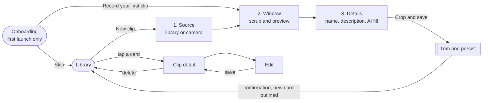
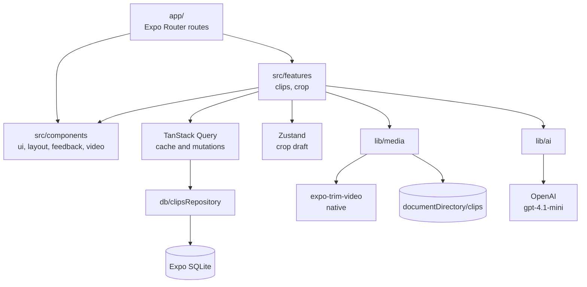
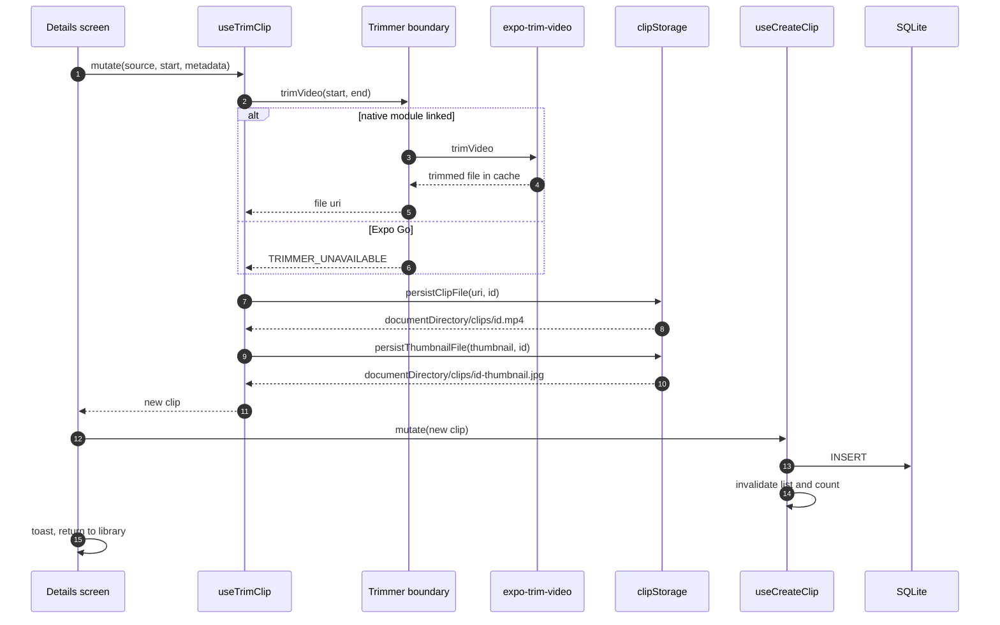
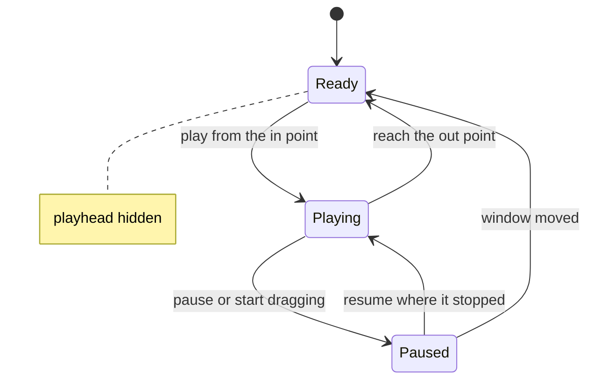
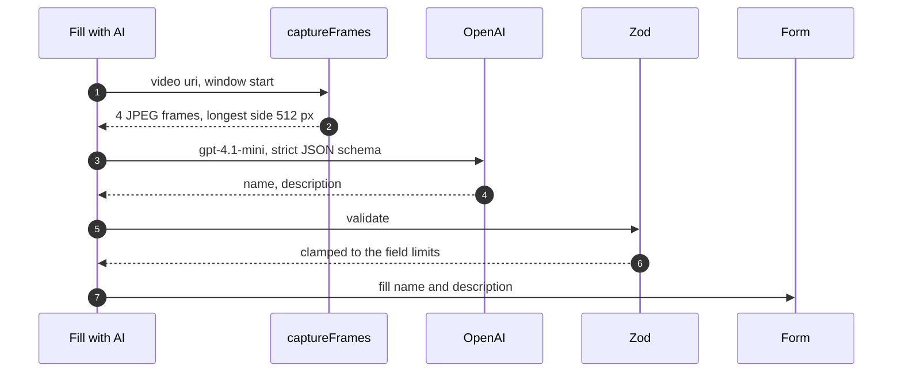

<div align="center">


# FiveSec

**A video diary where every entry is exactly five seconds.**

Import or record a video, slide a fixed five-second window to the moment worth keeping,<br />
name it, and it lands in your diary.

<br />

<a href="https://testflight.apple.com/join/F5AJNtQv">
  
  <br />
  <b>Test FiveSec on TestFlight</b>
</a>

<sub>Installs the iOS beta through Apple TestFlight</sub>

<br />
<br />


</div>

---

## Contents

- [Features](#features)
- [Try it](#try-it)
- [Getting started](#getting-started)
- [How it works](#how-it-works)
- [Case study coverage](#case-study-coverage)
- [Architecture](#architecture)
- [Developing](#developing)
- [Tech stack](#tech-stack)

## Features

- **Five-second clips.** A fixed window slides across a filmstrip of the source; start and end can
  never drift apart.
- **Preview before cutting.** Play exactly the selected five seconds, pause and resume where it
  stopped, with a playhead tracking the position on the strip.
- **Library or camera.** Pick an existing video or record a new one.
- **Native trimming.** `expo-trim-video` cuts the clip on device, driven by a TanStack Query mutation.
- **Fill with AI.** OpenAI `gpt-4.1-mini` names and describes a clip from frames of the selection.
- **Persistent diary.** Expo SQLite with versioned migrations and keyset pagination.
- **Edit and delete.** Rename or rewrite a clip later; deleting removes its files from disk.
- **First-run onboarding.** Five short screens introduce the flow once, then never again.

## Try it

**iOS:** the quickest path is the TestFlight beta linked above. Nothing to install or build.

**Everything else** depends on the trimmer being native code:

| | Expo Go | Preview or development build |
| --- | :---: | :---: |
| Browse, play, edit and delete clips | ✓ | ✓ |
| Pick or record a source video | ✓ | ✓ |
| Scrub the five-second window and preview it | ✓ | ✓ |
| Fill with AI | ✓ | ✓ |
| Export a clip | | ✓ |

`expo-trim-video`, the library the case study asks for, ships Swift and Kotlin. Expo Go runs a fixed
native runtime that cannot load it, so **Crop and save** reports that clearly instead of crashing.
That is a property of the library, and no JavaScript fallback can trim a video on device. For the
full flow, use a build:

```bash
npm run build:apk          # EAS, Android APK installable from the build link
npm run build:simulator    # EAS, iOS .app for the Xcode Simulator
npm run build:android      # local, needs Android Studio
npm run build:ios          # local, needs macOS and Xcode
```

The EAS builds are standalone and need no Metro server.

## Getting started

### Requirements

- Node.js 20 or newer
- Expo Go, or a build, on a device, simulator or emulator
- Xcode or Android Studio only for local native builds

### Run in Expo Go

```bash
npm install
npm start
```

Scan the QR code, or press `i` or `a` to open a simulator. `npm start` always targets Expo Go;
`npm run start:dev` targets an installed development build instead.

### Configure AI suggestions

Copy `.env.example` to `.env` and put in the OpenAI key sent by email. The fastest way to try the
app is the TestFlight link above; no key or local setup is needed for that.

```bash
EXPO_PUBLIC_OPENAI_API_KEY=sk-...
```

`.env` is gitignored, so the key never reaches the repository. EAS uploads the project using
`.easignore` instead of `.gitignore`, and `.easignore` leaves `.env` in, so EAS Build compiles the key
into preview and store builds. Restart Metro after changing it. Without a key the app still runs and
**Fill with AI** explains that it is not configured.

`EXPO_PUBLIC_` values are compiled into the bundle, so anyone holding a build can extract the key.
Use a dedicated key with a spending limit and revoke it once builds are no longer shared. A
production version would call OpenAI from a backend that holds the key.

### Scripts

| Run | |
| --- | --- |
| `npm start` | Metro for Expo Go |
| `npm run start:clear` | Same, with a cleared cache |
| `npm run ios` / `npm run android` | Open a simulator through Expo Go |
| `npm run start:dev` | Metro for an installed development build |

| Build | |
| --- | --- |
| `npm run build:apk` | EAS preview APK |
| `npm run build:simulator` | EAS iOS Simulator build |
| `npm run build:dev` | EAS development client, Android |
| `npm run build:dev:simulator` | EAS development client, iOS Simulator |
| `npm run build:android` / `npm run build:ios` | Local native build |
| `npm run prebuild` | Regenerate native projects after an `app.json` change |

| Quality | |
| --- | --- |
| `npm run verify` | Type check and lint |
| `npm run typecheck` | `tsc --noEmit` |
| `npm run lint` | ESLint |
| `npm run format` | Prettier |
| `npm run doctor` | Expo config and SDK version matrix |

## How it works



**Onboarding** runs on the first launch only. Five screens walk through the app: welcome, recording
and trimming, naming, Fill with AI (shown with the real button) and the library. Each step slides in
from the right like the rest of the app. **Skip** on any screen goes straight to the library and
leaves the camera permission for the first recording. **Record your first clip** on the last screen
asks for the camera, opens it, and hands the recording to the trim step with the library already
underneath.

**Library** lists clips newest first as cards with a thumbnail, duration badge, description and the
point in the source each was cut from. It pages in batches of twelve and pull-to-refresh re-reads
the database.

**New clip** opens a three-step flow:

1. **Source.** Pick a video at least five seconds long, or record one with the camera.
2. **Window.** Drag the window along the filmstrip or tap where it should land. The play button
   under the video plays exactly the selected five seconds, and pausing then playing again resumes
   where it stopped. A yellow playhead marks the position; the readout shows the in point, the
   playhead and the out point.
3. **Details.** Name and describe the clip, or let **Fill with AI** write both. **Crop and save**
   trims the clip, closes the flow and returns to the library with a confirmation and the new card
   outlined.

**Clip detail** plays the saved clip with its name, description and source in-point. **Edit**
changes the name and description, with the same AI fill. **Delete** removes the row and its files.

## Case study coverage

| Requirement | Implementation |
| --- | --- |
| Main screen with the cropped video list | `app/index.tsx`, `ClipList`, `ClipListItem` |
| Persistent storage | Expo SQLite, `src/db/` |
| Tap a clip to open its details | `app/clip/[id]/index.tsx` |
| Details show the video, name and description | `VideoPlayer` on the detail screen |
| Crop modal, step 1: video selection | `app/crop/index.tsx`, `useVideoSource` |
| Step 2: scrubber for a five-second segment, then next | `app/crop/trim.tsx`, `TrimTimeline` |
| Step 3: name and description, then crop | `app/crop/details.tsx`, `ClipMetadataFields` |
| `trimVideo` from `expo-trim-video` through TanStack Query | `useTrimClip`, `src/lib/media/trimmer.ts` |
| Expo Router, Zustand, NativeWind, Expo Video | `app/`, `cropDraftStore`, `tailwind.config.js`, `components/video/` |
| Reusable components such as VideoPlayer and MetadataForm | `VideoPlayer`, `ClipMetadataFields`, `useClipMetadataForm` |
| **Bonus:** edit page | `app/clip/[id]/edit.tsx`, `ClipEditForm` |
| **Bonus:** Expo SQLite | versioned migrations, keyset pagination |
| **Bonus:** Reanimated | trim gesture, playhead, card entrances, toasts |
| **Bonus:** Zod | `clipSchema.ts`, AI response validation |
| Beyond the brief | camera capture, AI fill, resumable preview with playhead, toasts, first-run onboarding |

## Architecture



```
app/                          Expo Router routes only
  _layout.tsx                 providers, navigation theme, guarded root stack, toast host
  onboarding/                 five-step first-run stack with a shared progress header
  index.tsx                   library
  clip/[id]/index.tsx         detail
  clip/[id]/edit.tsx          edit
  crop/                       three-step wizard stack
src/
  components/                 presentation, no domain knowledge
    ui/                       Text, Button, TextField, Badge, Timecode, BrandMark, Wordmark,
                              IconBadge, GradientText, TwinklingSparkles
    ui/icons/                 Plus, Sparkles, Playback, Camera, Pencil and Import icons
    layout/                   Screen, ScreenHeader, BrandHeader, StepIndicator, BottomBar, KeyboardAwareForm
    feedback/                 EmptyState, ErrorNotice, LoadingState, ProgressOverlay, ToastHost
    video/                    VideoPlayer, VideoThumbnail
  features/
    clips/                    schema, AI suggestion, read and write hooks, list and form components
    crop/                     draft store, source picker, filmstrip, preview, trim mutation, timeline
    onboarding/               completion store, step order, first-clip flow, step scaffold, previews
  db/                         SQLite client, versioned migrations, repository
  lib/
    ai/                       OpenAI config and structured-output client
    media/                    native trimmer boundary, clip storage, thumbnails, frame capture
    query/                    query client and key factory
    preferences.ts            persisted flags on the Expo SQLite key-value store
    toast.ts                  toast store and showToast
    errors.ts                 typed error codes and user-facing messages
    format.ts                 timecode, duration and date formatting
  theme/                      palette, fonts, brand mark, navigation theme, NativeWind interop
  constants/                  five-second window, field limits, page size
  types/                      domain types
```

Routes stay thin. They read params, call feature hooks and compose components; nothing in `app/`
knows about SQL, file paths or the native module.

### State ownership

Four kinds of state, four tools, no overlap.

- **SQLite** is the source of truth for saved clips. Schema changes go through numbered migrations
  guarded by `PRAGMA user_version`, and all access goes through `src/db/clipsRepository.ts`.
- **TanStack Query** caches everything read from the repository and owns the async lifecycle. The
  trim is a mutation, so progress, errors and retries come from one place. Writes invalidate the
  list and count keys and seed the detail cache.
- **Zustand** holds the crop wizard draft: the chosen source and the window start. It is in memory
  only on purpose, since an abandoned draft should not survive a restart. Scrubbing writes straight
  to the store, and only the components subscribed to `startMs` re-render.
- **The Expo SQLite key-value store** keeps one flag: whether onboarding is done. The onboarding
  store reads it synchronously when it is created, so the first frame already knows which screens to
  show. The root stack wraps onboarding and the main screens in complementary `Stack.Protected`
  guards, so completing onboarding swaps them without any manual redirect.

### Exporting a clip



`expo-trim-video` calls `requireNativeModule` at import time, which throws wherever the module is not
linked. `src/lib/media/trimmer.ts` uses `requireOptionalNativeModule` instead, so the package's types
are used but its entrypoint never enters the bundle. In Expo Go the module resolves to `null` and the
call surfaces a typed error rather than a crash.

The trimmed video and its thumbnail are both produced in the cache directory, where the OS may evict
them, so `persistClipFile` and `persistThumbnailFile` move them into `documentDirectory/clips` before
the row is written. A thumbnail that still fails to load falls back to a placeholder instead of an
empty frame.

`expo-trim-video` was published against an older SDK. It autolinks under SDK 57 and
`:expo-trim-video:compileDebugKotlin` succeeds against React Native 0.86, so no patch or fork is
needed.

### The five-second window

The window length is fixed, so the scrubber has one degree of freedom: where it starts. Start and
end are always five seconds apart, which rules out the invalid ranges a two-handle scrubber allows.

`TrimTimeline` runs the gesture on the UI thread with Reanimated shared values and never re-renders
while dragging. Updates cross to JavaScript on a throttle during the drag and once on release.



Playback position lives in a shared value owned by `useWindowPreview`, and the playhead reads it on
the UI thread. `timeUpdate` arrives every 100 ms, so each reported time is reached with a 100 ms
linear animation and the line glides instead of stepping. During playback it only moves forward: a
player can report a time slightly behind the pause point right after resuming, and those reports are
dropped. Seeks, resets and pauses place it directly. Only the timecode label crosses back to React,
at most every 50 ms. Whether play resumes or restarts is decided by `resumePosition`, a pure function
in `previewWindow.ts`.

### How the AI fill works



The model accepts images, not video files, so the clip goes out as frames sampled evenly across the
selected five seconds. Scaling each frame down keeps a request small even for 4K sources. A strict
JSON schema means the response parses without cleanup, and failures map to typed errors: a missing
key, a rejected key, rate limits, refusals and malformed output each get their own message. On the
details step the frames come from the source at the chosen window; on the edit page they come from
the saved clip.

### Scaling the list

The library query is a keyset paginator, not an offset one. The cursor is the `(created_at, id)` pair
of the last row, compared as a SQLite row value against the `(created_at DESC, id DESC)` index, so
page cost stays flat as the diary grows and rows cannot be skipped or repeated. Cards have a fixed
height, which lets `FlatList` use `getItemLayout` and skip measurement.

### Validation

One Zod schema in `src/features/clips/clipSchema.ts` backs both the create and edit forms through
`useClipMetadataForm`, so the wizard and the edit page cannot drift apart. AI suggestions go through
Zod too before they reach the form.

### Styling third-party components

NativeWind maps `className` only onto its own registry of React Native components. Anything outside
it, such as `VideoView`, receives `className` as an unknown prop and renders unstyled without an
error. `src/theme/interop.ts` registers the third-party components this app styles with `className`,
and the root layout imports it before the first render.

Animated views take plain style objects instead. Their styles are produced inside worklets, so
keeping the whole style in one place avoids merging a compiled class list with a shared-value style
on every frame.

### Brand assets

| File | Use |
| --- | --- |
| `assets/icon.png` | App icon, 1024 × 1024, opaque and full-bleed |
| `assets/adaptive-icon.png` | Android adaptive foreground, mark centred in the safe zone |
| `assets/splash-screen.png` | Full-screen iOS splash |
| `assets/splash-icon.png` | Centred Android splash mark |
| `assets/logo/five-sec-icon-white.png` | In-app mark, rendered through `src/theme/brand.ts` |

The source art has transparent rounded corners. iOS applies its own mask, so the app icon is
flattened onto `#F04642` as an opaque square rather than handing iOS a pre-rounded image and getting
notched corners. Android 12 and later only allow a centred icon on the system splash, so Android
shows the mark on the same red while iOS shows the full-screen artwork.

`#F04642` is also the app accent: the trim window, the active step and emphasised timecodes. It
carries destructive meaning too, so `accent` and `danger` resolve to the same value on purpose.

### Linting note

`react-hooks/immutability` and `react-hooks/purity` are disabled for exactly two files in
`eslint.config.js`. Reanimated shared values and `expo-video`'s `currentTime` setter are mutation-based
APIs by design, and both files use them inside worklets and event callbacks rather than during render.

## Developing

### The loop

Expo Go is enough for screens, navigation, state, queries and styling, with fast refresh. The moment
you touch the export path, build a development client once with `npm run build:dev`,
`npm run build:dev:simulator` or a local build, install it and run `npm run start:dev`. JavaScript
still fast-refreshes; the only difference is that the trimmer is linked.

### When a rebuild is needed

Only when native code changes:

- adding a dependency that ships native code
- editing `plugins`, `ios` or `android` in `app.json`, including icons, splash and permissions
- bumping the Expo SDK

After an `app.json` change run `npm run prebuild`, then build again. The `ios` and `android`
directories are generated and gitignored.

### Changing the database

`clips` is created by a numbered migration guarded by `PRAGMA user_version`. Editing the
`CREATE TABLE` in migration 1 changes nothing on a device that already ran it. Append an entry to
`migrations` in `src/db/migrations.ts` and raise `SCHEMA_VERSION` in `src/db/schema.ts`.

### Before committing

```bash
npm run verify    # tsc --noEmit && eslint .
npm run doctor    # Expo config and SDK version matrix
```

### Local build prerequisites

Android needs Android Studio and two environment variables it does not set:

```powershell
$env:JAVA_HOME    = "C:\Program Files\Android\Android Studio\jbr"
$env:ANDROID_HOME = "$env:LOCALAPPDATA\Android\Sdk"
```

iOS requires macOS with Xcode. From Windows, use the EAS simulator or development builds instead.

## Tech stack

| Concern | Choice |
| --- | --- |
| Framework | Expo SDK 57, React Native 0.86, React 19.2 |
| Navigation | Expo Router 57 with typed routes |
| Styling | NativeWind 4 with a custom dark theme on `#F04642` |
| Server state | TanStack Query 5 |
| Draft state | Zustand 5 |
| Persistence | Expo SQLite with versioned migrations |
| Video | Expo Video, Expo Video Thumbnails |
| Trimming | expo-trim-video |
| Animation | Reanimated 4, Gesture Handler |
| Forms | React Hook Form with Zod |
| Keyboard | React Native Keyboard Controller |
| AI | OpenAI `gpt-4.1-mini` with structured outputs |
| Language | TypeScript, strict |

Native package versions are pinned to the Expo SDK 57 matrix so the project runs in Expo Go without
a version mismatch.
